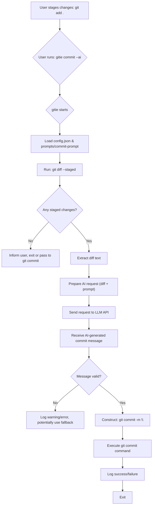

# Git Enhancer

`gitie` is a command-line tool that supercharges your Git workflow with AI capabilities. Currently, it focuses on automatically generating commit messages based on your staged changes.

## Features

-   **AI-Powered Commit Messages**: Automatically generates commit messages using a large language model (LLM) by analyzing your staged diff.
-   **Standard Git Commit Passthrough**: Seamlessly integrates with your existing `git commit` workflow. If you don't use the AI feature, it behaves like the standard `git commit`.
-   **Configurable**: Allows customization of the AI model, API endpoint, temperature, and system prompts.
-   **AI-Powered Command Explanation**: Get AI-generated explanations for Git commands and their options directly in your terminal.
-   **Tracing/Logging**: Provides detailed logs for debugging and monitoring.

## Installation

1.  **Prerequisites**:
    *   Rust and Cargo: [Install Rust](https://www.rust-lang.org/tools/install)
    *   Git: Must be installed and in your PATH.
    *   (Optional) An OpenAI-compatible LLM API endpoint (e.g., Ollama running a model locally, or a remote service).

2.  **Build from Source**:
    ```bash
    git clone <repository_url> # Replace with the actual repository URL
    cd gitie
    cargo build --release
    ```
    The executable will be located at `target/release/gitie`. You can copy this to a directory in your PATH, e.g., `~/.local/bin/` or `/usr/local/bin/`.

    ```bash
    # Example:
    # mkdir -p ~/.local/bin
    # cp target/release/gitie ~/.local/bin/
    # Ensure ~/.local/bin is in your PATH
    ```

## Configuration

`gitie` uses a `config.toml` file in its root directory for AI-related settings and a `prompts/commit-prompt` file for the system prompt used during commit message generation.

1.  **Create `config.toml`**:
    Copy the example configuration file `config.example.toml` to `config.toml` in the root of the `gitie` project (or the directory where you run the executable if it's globally installed and expects the config there - this might need adjustment for global installs).

    ```bash
    cp config.example.toml config.toml
    ```

    Edit `config.toml` with your preferred settings:
    ```toml
    [ai]
    api_url = "http://localhost:11434/v1/chat/completions"  # Your LLM API endpoint
    model_name = "qwen3:32b-q8_0"                           # The model to use
    temperature = 0.7                                        # LLM temperature
    api_key = "YOUR_API_KEY_IF_NEEDED"                       # API key, if required by your endpoint
    ```
    *   `[ai]`: Section for AI-related configuration settings
        *   `api_url`: The URL of your OpenAI-compatible chat completions endpoint.
        *   `model_name`: The specific model identifier your API endpoint expects.
        *   `temperature`: Controls the creativity of the AI. Higher values mean more creative/random, lower values mean more deterministic.
        *   `api_key`: Your API key, if the service requires one. This is optional.

    2.  **Customize `prompts/commit-prompt`**:
        The `prompts/commit-prompt` file contains the system prompt given to the AI to guide its commit message generation. You can edit this file to change the style, tone, or specific requirements for your commit messages.

        The default prompt encourages conventional commit style messages.

        *Note: If `config.toml` is not found, `gitie` will use default values, but it will fail if `prompts/commit-prompt` is missing.*

## Usage

`gitie` intelligently interprets your commands based on the arguments provided. AI features are **enabled by default**, and you can use the `--noai` flag to disable them. Here's a breakdown of how commands are processed:

**Priority 1: Help Requests (`-h` or `--help`)**

If your command includes a help flag (`-h` or `--help`):

*   **Default (AI enabled)**: `gitie` fetches the standard Git help text for the command and then provides an AI-generated explanation of that help text.
    ```bash
    # AI explains the help page for 'git commit'
    gitie commit --help
    
    # AI explains the help page for 'git status --short'
    gitie status --short --help
    ```
    
*   **With `--noai`**: The command is passed directly to Git to display its standard help message without AI explanation.
    ```bash
    gitie commit --help --noai  # Shows standard 'git commit --help'
    gitie status -s --help --noai # Shows standard 'git status -s --help'
    ```

*   **Note**: The `--ai` flag still works for backward compatibility but is no longer needed as AI is enabled by default.

**Priority 2: `gitie` Specific Subcommands (No Help Flag)**

If no help flag is present, `gitie` attempts to parse the command as one of its own defined subcommands (currently, only `commit` is a fully featured subcommand).

*   **`gitie commit` Subcommand:**
    This is the primary way to interact with `git-enhancer`'s own functionalities.
    *   **AI Commit Message Generation (default behavior)**: The core AI feature for the `commit` subcommand analyzes your changes and generates a commit message automatically.
        ```bash
        # If you've already staged your files:
        git add .
        gitie commit
    
        # Auto-stage all tracked, modified files and generate AI commit message (like git commit -a):
        gitie commit -a
        # or
        gitie commit --all
    
        # Generate AI commit message and GPG-sign the commit
        gitie commit -S
    
        # Combine auto-staging with other options:
        gitie commit -aS
        ```
    *   **Standard Commit**: Use the `--noai` flag to disable AI message generation and behave like the standard `git commit`.
        ```bash
        gitie commit --noai -m "My manual commit message"
        gitie commit --noai --amend # Opens editor to amend previous commit
        ```

**Priority 3: Global AI Explanation for Generic Git Commands (No Help Flag, and Not Parsed as a `gitie` Specific Subcommand)**

If the command doesn't include a help flag, and `gitie` fails to parse it as one of its own specific subcommands (e.g., `gitie status`, because `status` is not a `gitie` subcommand):

*   **Default (AI enabled)**: `gitie` will provide an AI-generated explanation of the Git command.
    ```bash
    # AI explains what 'git status -s' does
    gitie status -s

    # AI explains what 'git log --oneline -n 5' does
    gitie log --oneline -n 5

    # AI explains what 'git commit -m "message"' does
    gitie commit -m "A standard commit message"
    ```
*   **If no command is provided** (e.g., `gitie` with no other arguments): It defaults to explaining `git --help`.
    ```bash
    gitie # AI explains "git --help"
    ```

**Priority 4: Passthrough to Git (With `--noai` Flag)**

If the command includes the `--noai` flag, it's passed directly to your system's `git` installation (after removing the `--noai` flag).
```bash
gitie --noai status -s  # Executes 'git status -s'
gitie --noai push origin main # Executes 'git push origin main'
gitie --noai branch my-new-feature # Executes 'git branch my-new-feature'
```

### Logging

`gitie` uses `tracing` for logging. By default, logs are printed to standard error. You can control the log level using the `RUST_LOG` environment variable.

Example:
```bash
RUST_LOG=debug gitie commit
```

## Workflow Diagram (AI Commit)



## Development

For details on the project structure, contribution guidelines, and more, please see `doc/DEVELOPMENT.md`.

### Quick Links for Developers
- Building: `cargo build`
- Running tests: `cargo test` (once tests are added)
- Formatting: `cargo fmt`
- Linting: `cargo clippy`

## License

This project is licensed under the [MIT License](LICENSE). (Assuming MIT, add a LICENSE file if you choose this)
