### **C 语言安全框架**
```markdown
# 🛡️ C语言内存安全强化框架
## 🔍 核心原则：零信任内存管理

```mermaid
graph LR
    A[指针安全] --> B[边界校验]
    B --> C[资源所有权]
    C --> D[防御性终止]
```


## 📜 规范矩阵
| 风险类别       | 安全模式                    | 技术实施                          | CWE映射   |
|----------------|----------------------------|-----------------------------------|-----------|
| 缓冲区溢出     | 边界校验前置               | `strncpy(dst, src, sizeof(dst)-1)`| CWE-120   |
| 内存泄漏       | 资源获取即初始化(RAII)     | `FILE* fp = fopen(); if (!fp) abort()` | CWE-401   |
| 野指针         | 指针置空策略               | `free(ptr); ptr = NULL;`          | CWE-416   |

## 🚨 红线检查项
```c
// ❌ 危险模式
char buffer[32];
gets(buffer); // 未校验输入长度

// ✅ 安全替代
if (fgets(buffer, sizeof(buffer), stdin) {
    buffer[strcspn(buffer, "\n")] = 0;
}
```

## 🧪 测试用例
```c
TEST(MemoryTest, BufferOverflowProtection) {
    char dest[4];
    const char* src = "overflow";
    safe_strcpy(dest, src, sizeof(dest));
    ASSERT_EQ(dest[3], '\0'); // 强制截断验证
}
```
