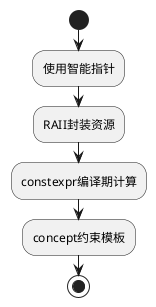

### **C++ 安全框架**
```markdown
# 🛡️ C++类型安全强化框架
## 🔍 核心原则：资源即对象


## 📜 规范矩阵
| 风险类别       | 安全模式                    | 技术实施                          | CERT映射  |
|----------------|----------------------------|-----------------------------------|-----------|
| 异常安全       | 强异常保证                 | `std::lock_guard`资源锁          | ERR55-CPP |
| 类型转换       | explicit构造函数           | `static_assert`类型约束          | EXP55-CPP |
| 多线程竞争     | 无锁数据结构               | `std::atomic<T>`                 | CON50-CPP |

## 🚨 红线检查项
```cpp
// ❌ 危险模式
void process(int* ptr) { delete ptr; } // 所有权不明确

// ✅ 安全方案
void process(std::unique_ptr<int> ptr) { /* 自动释放 */ }
```
