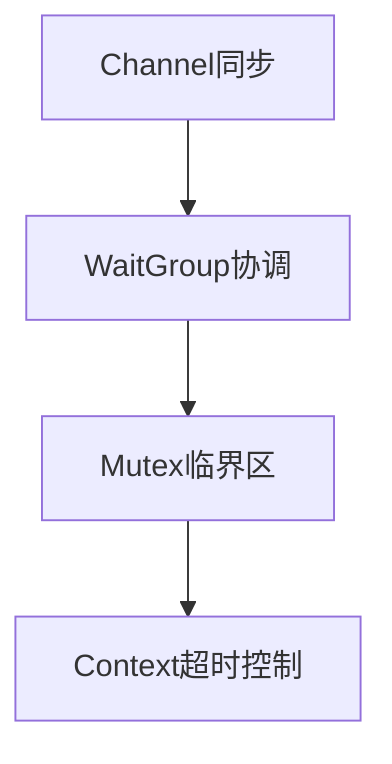

### **Go 语言安全框架**
```markdown
# 🛡️ Go并发安全强化框架
## 🔍 核心原则：通信共享内存


## 📜 规范矩阵
| 风险类别       | 安全模式                    | 技术实施                          | OWASP映射 |
|----------------|----------------------------|-----------------------------------|-----------|
| Goroutine泄漏  | 带缓冲Channel              | `select+time.After`超时机制       | OAT-007   |
| 空指针         | 防御性接口断言             | `if v, ok := x.(T); ok { ... }`   | OAT-003   |
| 数据竞争       | 拷贝传递替代指针           | `go func(v T) { ... }(value)`     | OAT-011   |

## 🚨 红线检查项
```go
// ❌ 危险模式
var m map[string]int // 未初始化直接写

// ✅ 安全方案
m := make(map[string]int)
m["key"] = 1 // 安全写入
```
