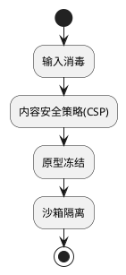

### **JavaScript 安全框架**
```markdown
# 🛡️ JS运行时安全强化框架
## 🔍 核心原则：沙箱隔离执行


## 📜 规范矩阵
| 风险类别       | 安全模式                    | 技术实施                          | OWASP映射 |
|----------------|----------------------------|-----------------------------------|-----------|
| XSS攻击        | DOM净化                    | `textContent替代innerHTML`        | A3:2021   |
| 原型污染       | 对象冻结                   | `Object.freeze(Object.prototype)` | A4:2021   |
| 依赖劫持       | 完整性校验                 | SRI哈希校验                       | A6:2021   |

## 🚨 红线检查项
```javascript
// ❌ 危险模式
eval(userInput); // 动态执行不可信代码

// ✅ 安全方案
const func = new Function('param', 'return ' + sanitizedInput);
```
