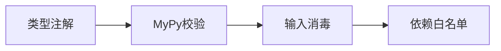

### **Python 安全框架**
```markdown
# 🛡️ Python类型安全强化框架
## 🔍 核心原则：显式优于隐式


## 📜 规范矩阵
| 风险类别       | 安全模式                    | 技术实施                          | CWE映射   |
|----------------|----------------------------|-----------------------------------|-----------|
| 反序列化漏洞   | 安全加载器                 | `json.loads()`替代pickle          | CWE-502   |
| 注入攻击       | 参数化查询                 | `sqlite3.execute(sql, params)`    | CWE-89    |
| 依赖混淆       | 虚拟环境锁定               | `pip freeze > requirements.txt`   | CWE-829   |

## 🚨 红线检查项
```python
# ❌ 危险模式
os.system(f"rm {user_input}") # 命令注入风险

# ✅ 安全方案
subprocess.run(['rm', static_path]) # 参数列表形式
```
