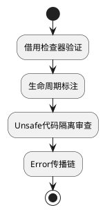

### **Rust 安全框架**
```markdown
# 🛡️ Rust内存安全强化框架
## 🔍 核心原则：所有权即安全


## 📜 规范矩阵
| 风险类别       | 安全模式                    | 技术实施                          | CWE映射   |
|----------------|----------------------------|-----------------------------------|-----------|
| 数据竞争       | Send/Sync trait约束         | `Arc<Mutex<T>>`共享状态           | CWE-362   |
| 空指针         | Option模式匹配             | `if let Some(v) = opt { ... }`    | CWE-476   |
| 内存泄漏       | 自动化析构                 | `impl Drop for Resource`          | CWE-401   |

## 🚨 红线检查项
```rust
// ❌ 危险模式
let raw_ptr = &mut x as *mut i32; // 不必要的裸指针

// ✅ 安全方案
let safe_ref = &mut x;
*safe_ref += 1; // 借用检查保护
```
