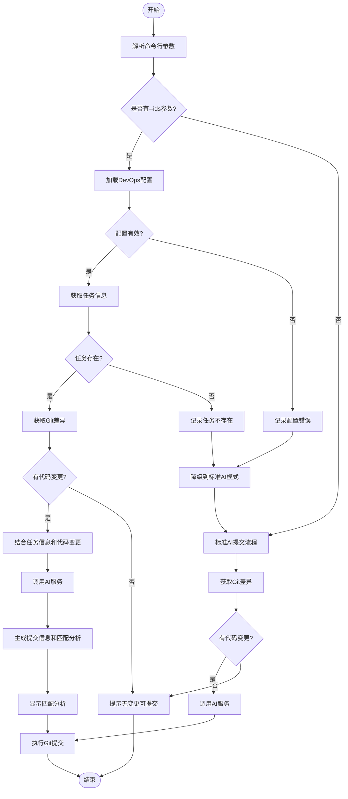

# Git增强工具DevOps平台集成需求文档

## 1. 背景与目标

### 1.1 背景说明
在软件开发过程中，开发人员通常在DevOps平台（如Jira、Azure DevOps、GitHub Issues等）上跟踪任务和需求。每次代码提交理想情况下都应与特定任务相关联。目前，我们的Git提交信息增强工具可以使用AI自动生成提交信息，但缺乏与DevOps任务的直接关联。

### 1.2 集成目标
通过添加DevOps平台集成功能，我们能够：
1. 自动获取任务卡片的详细信息
2. 分析代码变更与任务描述的匹配度
3. 生成更加相关且准确的提交信息

这一优化将帮助团队更好地追踪代码变更与业务需求的关系，提高开发过程的可追溯性。

## 2. 功能需求

### 2.1 DevOps平台集成

#### 2.1.1 需求描述
用户在使用`gitie commit`命令时，可以通过添加`--ids=TASK-ID`参数指定与本次提交相关的任务ID。工具将尝试从配置的DevOps平台获取任务详情，并使用这些信息辅助AI生成更相关的提交信息。

#### 2.1.2 实现逻辑
1. **DevOps配置管理**：
   - 在配置文件中增加`[devops]`部分，支持不同平台的配置
   - 支持验证配置有效性和连接测试

2. **任务信息获取**：
   - 解析用户提供的任务ID
   - 根据配置的平台类型和认证信息，调用相应API获取任务详情
   - 缓存任务信息以减少重复请求

3. **任务与代码变更匹配**：
   - 当用户同时使用`--ai`和`--ids`参数时，工具将：
     1. 获取指定ID的任务信息
     2. 获取代码变更（git diff）
     3. 将两者结合发送给AI进行分析
     4. 生成包含匹配度评估和针对性提交信息

4. **优雅降级处理**：
   - 如果无法获取任务信息（配置错误、网络问题、认证失败等），自动降级为标准的`--ai`模式
   - 提供清晰的错误提示，帮助用户排查问题

### 2.2 配置文件扩展

#### 2.2.1 DevOps配置部分
在现有的配置文件（`config.toml`）中，新增`[devops]`部分，包含以下配置项：

```toml
[devops]
# 支持的平台类型：jira, azure, github, gitlab等
platform = "jira"
# 平台API地址
api_url = "https://your-company.atlassian.net/rest/api/3"
# 认证信息
username = "your-email@example.com"
api_token = "your-api-token"
# 可选：项目前缀，用于在仅提供数字ID时自动添加前缀
project_prefix = "PROJ-"
# 可选：缓存设置
cache_expiry_minutes = 60
```

### 2.3 命令行接口

#### 2.3.1 新增参数
为`gitie commit`命令新增以下参数：

- `--ids=ID1,ID2,...`：指定与本次提交相关的任务ID，支持多个ID（用逗号分隔）
- `--no-devops`：临时禁用DevOps集成功能，即使提供了`--ids`参数

#### 2.3.2 命令行示例
```bash
# 结合AI和任务ID生成提交信息
gitie commit --ai --ids=PROJ-123

# 使用多个任务ID
gitie commit --ai --ids=PROJ-123,PROJ-124

# 仅使用数字ID（会自动添加配置的项目前缀）
gitie commit --ai --ids=123,124

# 禁用DevOps集成，仅使用AI
gitie commit --ai --no-devops
```

## 3. 用户体验

### 3.1 提交信息格式
当成功获取任务信息并生成提交信息时，输出的格式应包含：

1. 任务引用（例如：`[PROJ-123]`）
2. 简洁明了的变更摘要
3. 变更与任务的关联说明
4. 必要时的其他详细信息

### 3.2 错误处理
在集成过程中可能遇到的错误应得到妥善处理：

1. 配置错误：提供具体配置项的错误提示
2. 网络问题：显示连接失败信息和重试建议
3. 认证失败：提供认证问题排查指南
4. 任务不存在：显示未找到任务的提示

### 3.3 性能考虑
1. 任务信息缓存：减少重复API调用
2. 异步处理：获取任务信息时不阻塞主流程
3. 超时设置：防止API调用长时间等待

## 4. 流程图

### 4.1 DevOps集成提交流程 (`gitie commit --ai --ids=ID`)



## 5. 技术考虑

### 5.1 API客户端实现
1. 对主流DevOps平台（Jira、GitHub、GitLab、Azure DevOps）提供统一的抽象接口
2. 采用特质（trait）设计，便于扩展支持其他平台
3. 实现请求重试、限流处理等机制

### 5.2 数据模型
1. 设计任务数据结构，统一不同平台的任务表示
2. 任务匹配结果数据结构，包含匹配度评分和分析内容

### 5.3 AI提示优化
1. 针对任务匹配分析设计专用提示模板
2. 引导AI生成结构化的匹配分析结果和提交信息

## 6. 测试策略

### 6.1 单元测试
1. DevOps配置解析和验证测试
2. 任务ID解析和格式化测试
3. 各平台API客户端的模拟（mock）测试

### 6.2 集成测试
1. 配置加载与API调用集成测试
2. AI服务与任务信息集成测试
3. 完整提交流程测试

### 6.3 手动测试场景
1. 正确配置下，提供有效任务ID的提交
2. 网络中断情况下的降级行为
3. 无效任务ID的错误处理
4. 多任务ID的处理逻辑